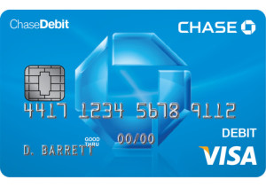

Banking giant JP Morgan Chase & Co. has begun issuing EMV debit cards, with plans to convert its entire debit card portfolio of 34 million cards to chip by the end of 2016, Chase announced Tuesday. Chase began testing chip-enabled debit card issuance in Arizona and Illinois two months ago, a Chase spokesman tells Digital Transactions News. Chase expects 70% of its debit cards to have chips by year’s end. The spokesman would not say how much the EMV debit conversion will cost Chase. One estimate is that a chip card may cost between $3 and $7 to issue. On the low end, the conversion thus might cost $102 million.

Chase debit card holders with lost, stolen, damaged, or expired cards will receive the chip versions first, as will consumers opening new accounts. “Our mass reissuance will occur in the next 12 months,” the spokesman says. The plans also call for converting Chase’s Liquid prepaid cards to chip.

EMV is meant to better secure point-of-sale transactions by migrating credit and debit cards from magnetic-stripe payments to chip ones. Issuers are expected to dramatically increase the number of chip-enabled credit and debit cards over the next several months in anticipation of the payment card networks’ Oct. 1 liability shifts that will place the onus for fraudulent transactions at the point of sale on the party, whether it’s the merchant or acquirer, least prepared for an EMV transaction.

CardWorks Acquiring - Merchant Services continues to work with our industry partners to provide merchants with affordable, easy-to-implement EMV solutions with the industry's best security capabilities. To ensure your equipment is EMV compliant, contact CardWorks Acquiring Merchant Support today at (866) 210-4625 X1 or via email at merchantsupport@cardworks.com.

Want to read the rest of this story? Check out [Digital Transactions](http://digitaltransactions.net/news/story/Chase-Begins-Issuing-EMV-Debit-Cards_-Expects-To-Reach-70_-of-Cardholders-by-Year_s-End).
