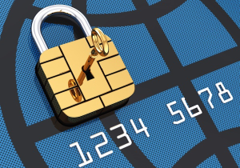

#### EMV Shift : Real Life "Mad Men" Take on EMV Marketing

One of the more difficult challenges of the U.S. EMV conversion is [getting the word out](http://www.paymentssource.com/news/regulation-compliance/a-third-of-us-merchants-have-never-heard-of-emv-report-3020533-1.html), especially given the urgency of the October deadline the card networks set for a fraud liability shift.

Some companies are starting to treat this marketing challenge as an opportunity, making their advertising more about the shift to EMV security than about their own products. ShopKeep, a mobile point of sale provider, is running an advertising campaign that cuts straight to the chase.

One ad states bluntly: "The card companies will hold you liable for fraud if you don't have EMV technology — liable for their cards. That's going to make you mad."

Partners and Napier New York produced the ShopKeep ad campaign, which features two television spots and other digital content. One of the TV spots is a branding message around ShopKeep tied to the need to migrate to EMV, the other general messaging around EMV, liability and ShopKeep's role.

"The liability shift is coming, and among our target market of small to medium sized businesses there's not a lot of awareness," said Brian Zang, senior vice president of sales and marketing at ShopKeep. "They mostly have their heads down running their businesses."

"It starts with consumers. Consumers don't necessarily know what EMV is," Zang said. "If you've traveled that means 'OK, my card has a chip on it now.' But I don't think that people understand what it means for the larger payment industry."

CardWorks Acquiring – Merchant Services continues to work with our industry partners to provide merchants with affordable, easy-to-implement EMV solutions with the industry’s best security capabilities. To ensure your equipment is EMV compliant, contact CardWorks Acquiring Merchant Support today at (866) 210-4625 X1 or via email at merchantsupport@cardworks.com.

To read the rest of this story, visit [PAYMENT SOURCE.](http://www.paymentssource.com/news/technology/real-life-mad-men-take-on-emv-marketing-3021423-1.html?utm_campaign=atm%20debit-may%2028%202015&utm_medium=email&utm_source=newsletter&ET=paymentssource%3Ae4458611%3A4753333a%3A&st=email)
