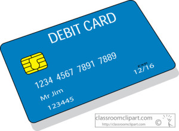

 

### Americans are using debit cards more, especially for small dollar purchases.

They also make fewer withdrawals from ATMs than they did just a decade ago. These are two key trends reported in the 2015 Debit Issuer Study from Pulse, a network owned by Discover Financial Services.

Meanwhile, the Federal Reserve has published a “clarification” of how it determined debit interchange caps when it was directed to do under the Durbin Amendment to the 2010 Dodd-Frank Act.

The Fed has come under fire for years for a ruling it issued in 2011 that capped debit card interchange as directed by the Durbin Amendment. The National Association of Convenience Stores successfully argued before a U.S. district court that the cap set by the Fed – 21 cents per transaction plus an adjustment for fraud prevention – was too low.

But the district court’s decision was overturned last year by the U.S. Court of Appeals for the District of Columbia Circuit. The appeals court, however, instructed the Fed to explain one aspect of the ruling, the treatment of fraud protection and prevention costs. That explanation, published recently in the Federal Register, makes distinctions between fraud tools used at the transaction and program levels.

10-year track record

Pulse is one of the oldest debit card networks in the nation and an early champion of POS debit. It commissions a yearly debit issuer study. The latest, the 2015 Debit Issuer Study, reveals that over the past 10 years, debit card usage has grown 32 percent.

“The past decade saw a major shift in consumer preference to paying with debit cards, which accelerated after the 2008-2009 recession,” said Steve Sievert, Executive Vice President for marketing and communications at Pulse. “We believe there is still opportunity for debit growth, considering that consumer use of debit for smaller purchases is rising, and the average active debit card is used about five times per week.”

Tony Hayes, a Partner at Oliver Wyman Group who co-led the study, said, "Consumer use of debit has been nothing short of remarkable. Debit has steadily gained wallet share as consumers shift their spending to this payment type. The use of debit for small-ticket purchases is particularly noteworthy, where one-third of all debit transactions are for less than $10 – purchases that historically would have been made with cash or not at all."

Debit cards have been available for POS payments since the 1980s but only began to gain significant market share in the 1990s, when Visa Inc. and MasterCard Worldwide logos began appearing on debit cards, and the networks behind those logos began clearing debit card payments authorized at the POS by cardholder signatures. Debit card activity grew to equal credit card payments in the early 2000s, and about 10 years ago, yearly debit card tallies began to exceed those for credit cards.

The credit crunch that began in 2008 contributed to some of this growth, as consumers postponed credit spending. So did growing adoption of prepaid debit cards. Now, the yearly total of PIN, signature and prepaid debit card spending is nearly double the total for credit card payments, according to Pulse. The average active debit cardholder conducted 23.2 debit card transactions (POS and ATM) in 2014, according to the study.

## Weighing Durbin

Ten years ago financial institutions were receiving a weighted average interchange of 41 cents on a consumer debit card transaction. The Durbin Amendment – or more specifically, Federal Reserve Regulation II, which implemented the legislative mandate – changed that by capping debit card interchange at 21 cents plus a markup for fraud prevention. The cap, however, only applies to banks with $10 billion or more in assets.

In 2014, debit card issuers subject to the caps earned a weighted average interchange of 24 cents on each card transaction, while exempt institutions earned 40 cents per transaction in interchange, according to the study.

The drop in per-transaction earnings has been offset somewhat by growing usage, however. In 2008 (pre-Durbin) debit card issuers earned an average $81 in annual interchange per active debit cardholder, according to Pulse’s historical data. According to the latest study, exempt issuers generated an average of $112 per card in debit interchange revenue in 2014; the average was $59 per card for issuers subject to the Durbin debit caps.

Here are further key data points from the Pulse report:

- Active cardholders averaged 16.1 POS debit transactions a month in 2005; in 2014 the average had jumped to 21.1 per month.
- In 2005, the average annual spend per active debit card was $7,807; in 2014 it was $9,291.
- The average debit card ticket was $40 in 2005; that dropped to $37 in 2014
- The average active cardholder made 3.4 ATM withdrawals month in 2005, but just 2.0 per month in 2014.

For more information on Debit Cards, please contact CardWorks Acquiring - Merchant Services

Phone: (866) 210 - 4625 X1

Email: merchantsupport@cardworks.com

 

Full article at [Greensheet.com](http://www.greensheet.com/breakingnews.php?flag=breaking_news)
