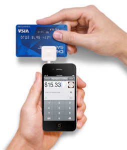

 

The mobile point of sale market already seems overcrowded, but what's out there now is just a taste of what's to come, according to 451 Research.

The global installed base of mobile point of sale technology will grow to 54.03 million units in 2019 from 13.3 million units this year. That's a fourfold increase and a 32% compound annual growth rate.

The factors driving the growth are diverse and cover a range of geographies and industries. In emerging markets, mobile point of sale terminals promote financial inclusion. In more developed economies, the technology is a line-buster at retailers and helps overall engagement.

"We think of mPOS as a fairly well penetrated technology, but we've only scratched the surface," said Jordan McKee, a senior analyst covering mobile payments for 451 Research.

In North America, larger businesses with more than 1,000 employees are increasingly deploying mobile point of sale technology, and 87% of IT decision makers say that accepting card payments on a mobile device and providing a real-time receipt is important, according the research.

Please contact CardWorks Acquiring for more details on Mobile POS options.  (866) 210-4625 X 1 or email merchantsupport@cardworks.com.

For the rest of this article, visit Payments Source.
