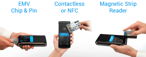

 

 

One of the more perplexing elements of the slow, long-awaited march to EMV-chip cards in the U.S. is the lack of awareness that still pervades among merchants and consumers alike.

At the same time, mobile wallets such as Apple Pay have had no trouble becoming household names despite having fairly low adoption.

Three months past the U.S. EMV liability shift — the soft deadline set by the card networks for EMV adoption — Scott Holt, a vice president at Ingenico in North America, sees a chance to finally shift consumers away from their old payment methods. The twist is that it won't be by consumers' choice.

By the end of 2016, much of the U.S. retail market will be compliant with EMV and mobile wallets, Holt said. Consumers will have no choice but to abandon magnetic stripe payments, but when they do it will open up the opportunities to choose something other than EMV's chip-and-dip process, he said. "People will have to learn a new experience with EMV anyway."

The migration to both Near Field Communication-based wallets and EMV will place pressure on floor-level personnel at retailers to educate consumers on the new technologies. In particular, cashiers are the key to a smooth transition to new payments technology, as Beatta McInerney, a business development manager of payments for point of sale technology company ScanSource POS and Barcode, explains in recent column for PaymentsSource.

Retailers must train cashiers to spot if a consumer has an EMV chip even if the merchant is not accepting EMV cards at this point, McInerney said. This gives retailers an opportunity to teach the process at a more measured pace.

"Consumer experience is largely dependent on the education of retailers," Holt said, adding that includes the skills to recognize and help consumers who are confused about how the new terminals work. Placing the right prompts into point of sale software is also important, he said.

The delays aside, Ingenico reports the EMV migration in the U.S. is progressing similar to other countries, adding it's tracking the migration to tailor the education it will provide to merchants over the course of the next year.

Read the rest of this article at [PAYMENTSSOURCE.COM](http://www.paymentssource.com/news/retail-acquiring/how-can-merchants-close-the-emv-nfc-knowledge-gap-3023028-1.html?utm_medium=email&ET=paymentssource:e4988932:a:&utm_source=newsletter&utm_campaign=-dec%2017%202015&st=email).
