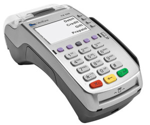

Only 37% of U.S. merchant locations are fully equipped for EMV card acceptance, narrowly missing a projected 40% rate of deployment predicted by management consulting firm Strawhecker Group, according to research it published Wednesday.

The current study showed payment processor readiness, gateway readiness, and technical staff resource availability affected the speed of implementation most. The card networks set an Oct. 1, 2015 date for EMV adoption, after which non-compliant parties faced a shift in fraud liability.

Jared Drieling, business intelligence manager at TSG, anticipates a faster rate of implementation by merchants who delayed to avoid any changes to the payment process ahead of the 2015 holiday season.

“It appeared that some merchants delayed EMV migration completely until the holiday season ended to prevent friction and confusion at the checkout line,” he said in a Feb. 17 news release. “I suspect that many merchants that have delayed, especially merchants in higher risk categories, felt the impact of the liability shift last year and we’ll see them aggressively ramp up plans to migrate.”

TSG said it expects 50% of merchant locations to be able to accept EMV cards by June, and 90% in 2017.

TSG sampled 92 payments services providers that service almost 4 million merchants, or 50% of card transactions.

 

CardWorks Merchant Services is offering FREE upgrades to EMV equipment for all merchants new and old.  Reach out to your sales agent or our Merchant Support Team (merchantsupport@cardworks.com) for more information about becoming compliant today!

 

 

Source: [PaymentSource](http://www.paymentssource.com/news/retail-acquiring/merchant-emv-migration-slower-than-anticipated-report-3023517-1.html?utm_medium=email&ET=paymentssource:e4988932:a:&utm_source=newsletter&utm_campaign=-feb%2018%202016&st=email)
