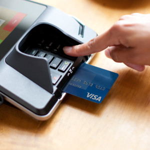

 

Many consumers and merchants adjusting to using newly-issued EMV credit and debit cards may undergo a perception versus reality check as Visa Inc. prepares to debut its Quick Chip for EMV program. Visa also provided updated chip card issuing and acceptance data.

Announced Tuesday, the program enables consumers to remove their EMV cards typically within two seconds of inserting them into compatible point-of-sale terminals. The program addresses a perception issue that chip transactions take more time than those made with a magnetic-stripe payment card, Stephanie Ericksen, Visa vice president of global risk products, tells _Digital Transactions News_.

“With more and more cardholders and merchants using chip cards as part of their lives we have heard concerns about chip transactions,” Ericksen says. The move will enable consumers to put away their cards quicker while the merchant rings up purchases.

Unlike mag-stripe transactions, the chip card must be inserted and left in the POS terminal until authorization. That is a measure to ensure the card is not counterfeit. The Quick Chip program does not alter the speed or components of an EMV transaction, Ericksen says. What it does is to enable the consumer to remove the card from the reader prior to the authorization response.

“From a card perspective no changes are required,” she says. “It works on all our cards today.”

What does need to change is the instruction sent to the POS terminal. “There’s a small change to the terminal to allow for the prompt to remove the card in advance of the authorization response,” she says.

No additional testing or certification is necessary because this protocol is part of the EMV standard already, Ericksen says. The middleware provider, terminal maker, or potentially the acquirer or processor has to make the prompt alteration.

The process is somewhat similar to when a power outage strikes a merchant location that has EMV terminals, she says. In that case, the transaction proceeds, but the authorization response is deferred until the terminal connects again. “It’s already an existing function being used today in some environments,” Ericksen says, pointing to in-flight EMV transactions that are processed once the plane lands.

Already, some payments-industry companies are working with Visa on reduced insertion times, including processor Total System Services Inc. (TSYS), POS terminal makers Equinox Payments and Ingenico Group, and payments software and certification firm B2. No merchants are enrolled yet, but Ericksen says Visa is working with some to do just that.

Meanwhile, Visa’s update on EMV data shows that for the first time there are more EMV debit cards in issue in the U.S. than EMV credit cards. As of March 31, there are 133.9 million Visa debit EMV cards and 131 million Visa credit EMV cards. The total of 264.9 million is 86.6% higher than the 142 million cards in October 2015, making the United States the largest chip-card market. At the end of December, Visa said there were 212 million Visa chip cards, but it did not split the total by credit or debit.

Issuers delayed their EMV debit card plans while technicalities over a software tweak to enable multiple debit network transaction-routing options were worked out. The tweak was necessary to comply with the Durbin Amendment to the 2010 Dodd Frank Act.

Visa also says there are 1 million merchant locations with chip-enabled terminals, or about 20% of all merchants, Ericksen says. More than three-fourths of them are small and mid-size merchants.

Counterfeit card fraud, which EMV chip cards aim to prevent, is down at the five top chip-enabled merchants by 18.3% from the fourth quarter of 2014 to the same quarter in 2015. That contrasts with the top five non-EMV merchants, which saw counterfeit card fraud increase 11.4% in the same period.

Once at least 50% of U.S. payment card transactions are made with chip cards at chip-activated terminals—in a so-called chip-on-chip transaction—fraud rates will begin to decline, Ericksen says. “That’s where we start to see occurrences of the counterfeit card fraud trend line go down overall.”

 

source [Digital Transactions](http://www.digitaltransactions.net/news/story/Visa-Tweaks-Chip-Card-Processing-Protocol_-Says-EMV-Debit-Cards-Now-Surpass-Their-Credit-Brethren)
