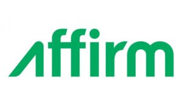

 

Affirm has made it no secret that its success will hinge on its ability to offer customers a wide range of retail partners where they can frequently use Affirm to pay.

While the lending startup originally launched with niche partners like Casper mattresses and Boosted Boards, they have expanded partnerships to over 700 retail merchants with the hopes of tempting a more diverse range of shoppers to try the service.

But today at Shoptalk Affirm announced they are partnering with Expedia and Eventbrite to offer 3-, 6-, or 12-month payment plans to customers buying intangible “experiences” like a vacation or concert ticket.

On the surface, the benefits for both sides are clear. Affirm gets a large, pre-existing customer base with whom it can offer financing, and Expedia and Eventbrite get to offer their customers a new payment option, which Affirm says typically leads to increased sales performance by retailers.

But are one-time experiences really something consumers should finance? The answer is probably that it depends on when the actual experience is in relation to when you made the purchase.

For instance, it would be nice to pay over six months _before_ you fly to that exotic country you’ve always been dying to visit. But on the other hand, who wants to be stuck paying for six months _after_ you’ve experienced the trip?

Financing experiences also raises the question of whether or not shoppers will still repay Affirm after they already went on a vacation. With a tangible good, you continue to gain utility every day for months or even years after you’ve repaid the company. But with a vacation, shoppers may be more likely to leave Affirm on the hook for the balance of the trip when they are still paying a year after the experience they now barely remember.

The company’s response to this is that they will be treating travel and ticketing the same way as material goods, and still will use “thousands of data points” to assess a consumer’s ability to repay. And, if repayment trends do change, they will “adjust their models accordingly to ensure they approve consumers in ways that maximize repayment rates”.

As we’ve discussed before, high-interest rate financing plans like the ones offered by Affirm can be a sticky situation.  On one hand, there is a risk of customers using the service irresponsibly to finance nonessential items that they can’t afford. But, if used responsibly,  Affirm can empower consumers to stretch their dollar – so they don’t have to settle for goods or experiences that they don’t really want, but are the only thing they can immediately afford.

[TechCrunch](http://techcrunch.com/2016/05/17/affirm-is-partnering-with-expedia-and-eventbrite-so-you-can-pay-for-experiences-over-time/)
