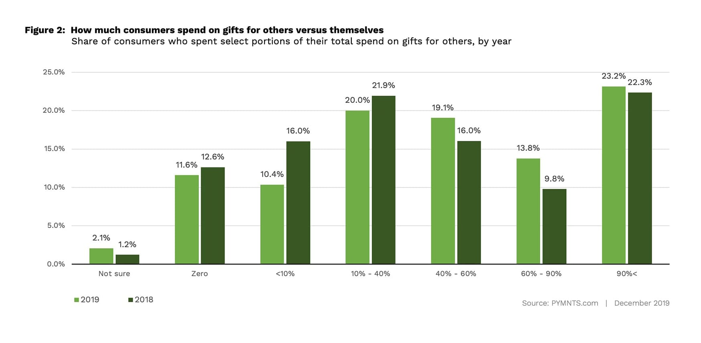

Black Friday is the traditional start of the holiday shopping season and this year 151 million consumers got their Black Friday shopping groove on. This year, that groove was more online than at a physical store, but with all income groups spending at least 25 percent more this year than last. Millennials were the biggest spenders. That’s according to a hot-off-the-presses PYMNTS study of more than 2,000 U.S. consumers to find out what they bought, where they shopped and how they paid. Here’s what we learned.

What did you do the Friday after Thanksgiving? PYMNTS asked 2,000 consumers that very same question – and what they told us may surprise you.

Of course, the [day](https://www.pymnts.com/news/retail/2019/retailers-start-new-traditions-with-innovation-around-the-holidays/) after Thanksgiving in the U.S. is known as “Black Friday” — the traditional start of the holiday shopping season in the U.S. Once upon a time, that meant shoppers lining up outside brick-and-mortar stores at 5 a.m. that day to be among the first to grab those infamous “doorbuster” deals — proudly proclaiming the accounts of their retail adventures at the holiday family gatherings to come — until the smartphone came along.

Today, instead of setting the alarm for 4 a.m. to get in line, consumers go online — popping open apps and letting their fingers and thumbs do the shopping.

This year was no exception.

What our 2,000 consumers told us is probably indicative of your behavior, too.  Our findings suggest that not only is Black Friday increasingly digital, but that going digital has reshaped the holiday shopping experience in many unexpected ways.

For instance, 40 percent of U.S. consumers didn’t shop on Black Friday at all. Those who did shopped at physical stores less. And they did a lot of buying for themselves.

Black Friday shopping — in terms of the number of consumers who observed this holiday shopping ritual — is roughly the same as we saw last year. In 2019, 59.5 percent of U.S. consumers (151 million) bought at least one thing at a store the day after Thanksgiving, down ever so slightly from 61.8 percent (157 million) in 2018. Those who didn’t say they didn’t because of store crowding, that they did not need anything, could not afford it or they prefer to spend their time doing other things. Those who did went hunting for deals (more on that later).

In 2019, we saw consumers are trading standing in line at the physical store more for the ease and convenience of buying online. About one in five consumers (20.4 percent) who shopped on Black Friday only did so online, up 10 percent from 18.6 percent in 2018. One in five consumers (20.2 percent) only went to a physical store to shop on Black Friday in-store, compared to 25.6 percent a year before. That’s a decrease of 21 percent.

The Black Friday reality though is a little mix of both. The Black Friday shopper is an omnichannel shopper with 18.2 percent of shoppers buying online and in the store. That is up slightly from 2018, as a result of fewer people going to the physical store to shop.

We also observed that Black Friday shopping has also become less about shopping for others and more about shopping for “me.”

This year, more than 23.2 percent of consumers said that they spent more than 90 percent of their Black Friday shopping dollars on buying gifts for others, compared to 22.3 percent in 2018. Not quite a quarter — but close — of all Black Friday shoppers said that 90 percent or more of their purchases were for themselves.

We see some interesting differences by shopping channel too.  Slightly more than half (56 percent) of shoppers in the store spent more than 40 percent on “gifts” for themselves this year (compared to 48.2 percent in 2018), while 59 percent of Black Friday online shoppers spent more than 40 percent of their budgets on gifts for others in 2019.

**All Consumers Spent More On Black Friday In 2019, But Millennials Spent The Most**

Consumers across every income bracket increased their Black Friday spending by 34.1 percent between 2018 and 2019, on average. The largest increase in spending was among those earning more than $100,000 in annual income, who spent $143.70 more than last year. Black Friday shoppers earning between $50,000 and $100,000 per year spent $80.40 more than last year, and those earning less than $50,000 spent $47.10 more than last year, on average.

As a percent of their income, though, the percent of the increase in spending across each of these income brackets was similar. Consumers who earned less than $50,000 per year spent 25.9 percent more in 2019 than in 2018, while those who made between $50,000 and $100,000 per year spent 25.5 percent more. Consumers who earned more than $100,000 in annual income were the outliers here, having spent 34.1 percent more on Black Friday than they did last year.

This year, [millennials](https://www.pymnts.com/news/retail/2019/generational-differences-take-shape-for-holiday-shopping-season/) were the big Black Friday spenders, shelling out an average of $509.50 on Black Friday purchases this year, compared to an average of just $382.40 in 2018. More millennials in the workforce mean more millennials with money to spend on holiday presents (as well as for themselves).

Bridge millennials, those between 30 and 40 years of age who “bridge” the age gap between Generation X and millennials, spent big, too, shelling out an average $479.40 on Black Friday this year — the second-highest average of any age group.

Both millennials and bridge millennials prefer to buy gifts for others online, with 48 percent and 54.1 percent of their Black Friday spend for holiday gifts happening online and not in physical stores.

**Deals Drive Black Friday Shoppers To The Physical Store – But Not As Much As They Used To**

Not surprisingly, given Black Friday’s roots in physical retail, [retailers](https://www.pymnts.com/news/retail/2019/with-fewer-shopping-days-retailers-ramp-up-sales-delivery/) have trained shoppers that Black Friday is “deal day” and to expect those big “doorbuster” savings in their stores. And that is what still drives many shoppers to the physical store on that day. This year, 53 percent of consumers who bought at least one item in-store said that they did it to get access to those special deals.

But the percent of Black Friday shoppers who do that is down from last year when 59.1 percent of Black Friday shoppers said they specifically went to the physical store to get a deal.

Ease and convenience, which drives so much of the consumer’s online shopping experience every other day of the year, also seems to be driving the behaviors now of Black Friday shoppers. Deals are still key, but convenience trumps the deal for most – and mostly because consumers can now get many of the same great deals online. Sixty-five (65) percent of Black Friday shoppers who bought at least one thing online, did so at least in part because it was easy and convenient. In-store deal hunters, apparently show an abundance of patience, spending as many as 8 hours or more tracking them down.

**Buying Clothes Topped The Black Friday Shopping List Again In 2019**

Black Friday spending in both 2018 and 2019 was primarily driven by purchases of clothing and accessories, with a sharp increase in the number of consumers making those purchases online. Even though just as many Black Friday shoppers who bought clothes bought them in the physical store this year (57.3 percent in 2019, 57.8 percent in 2018), nearly as many made those purchases online. In 2019, 56 percent of Black Friday shoppers who bought clothes did so online, up from 49.7 percent in 2018.

Electronics came in second place again this year, but with a shift to online purchasing as well. Only 44.6 percent of respondents who shopped on Black Friday this year bought electronics in-store, down from 48.3 percent who did so last year. We found that 51.6 percent of respondents who shopped on Black Friday this past weekend bought electronic goods online, up from 47.4 percent who did so last year.

**Credit cards, debit cards and cash – in that order – were what Black Friday shoppers used to pay for their purchases. And shoppers used them mostly at Amazon and Walmart.**

Credit cards, debit cards and cash were kings on Black Friday as more than 50 percent of all Black Friday shoppers chose credit when checking out at the physical store or online. As seen in Figure 8, 49.3 percent of brick-and-mortar shoppers and 54.3 percent of online shoppers used credit cards to pay for what they bought in 2019, with 42 percent and 36 percent of Black Friday shoppers opting for debit cards in-store and online, respectively.

PayPal saw a big uptick online by Black Friday shoppers, with roughly a quarter of all Black Friday online shoppers using it to make a purchase. So did Amazon Pay, not surprisingly since nearly three-quarters of Black Friday shoppers in our study reported making at least one Black Friday purchase at Amazon using their buy button.

Alt credit providers, including PayPal Credit, Affirm, [Afterpay](https://www.pymnts.com/news/alternative-financial-services/2019/the-week-in-payments-how-alternative-payments-are-changing-black-friday/), Sezzle and Klarna were among the options that a few Black Friday shoppers said they used at least once, as well.

Consumers also reported using credit cards less often online this year as they did last year. We attribute at least part of that reported shift to be the result of an increase in the use of online wallets like PayPal and the other “Pays” that have registered credit card credentials available to enable their purchases.

Even millennials used credit cards to pay for their purchases, with 49.2 percent reporting that credit cards were how they paid for their online Black Friday purchases and 46.5 percent saying they paid using credit cards for in-store purchases. Millennials also reported using debit (41.1 percent online and 45.2 percent in store) as well as alt payments providers, including the Pays and alt credit platforms. Bridge millennial payments preferences reflect nearly identical payments preferences.

As mentioned, Amazon topped the list of all Black Friday shopping destinations, with 73 percent of Black Friday shoppers making at least one purchase there. A distant second is Walmart with 38 percent and large national chains such as Macys and Nordstrom, with roughly 28 percent of Black Friday shoppers making a purchase those stores.

**Black Friday Is Just The Beginning, And Not The End, Of The Consumer’s Holiday Shopping**

As you no doubt noticed, the consumer’s inbox was flooded with Black Friday deals long before Black Friday. Pre-Black Friday deals and VIP access to Black Friday specials have made Black Friday a multi-day shopping event that bleeds into Cyber Monday and the mad rush to the holiday finish line.

It’s a good thing.

Eighty-two percent of the consumers in our survey plan to finish purchasing holiday gifts after Black Friday, with 6 percent saying they will not be done until after Christmas.  As long as retailers continue to deck the halls with deals, consumers, it seems, will continue to let their fingers and thumbs do the shopping.

https://www.pymnts.com/news/payment-methods/2019/new-data-millennials-drove-2019s-black-friday-spend/
