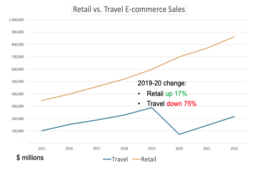

COVID-19 has changed everything about the way we live, and [this trend doesn’t seem to be pausing for the holidays](https://www.cdc.gov/coronavirus/2019-ncov/daily-life-coping/holidays.html). Parties are significantly smaller or nonexistent, many out-of-state family members won’t be returning home, and tree lighting ceremonies have gone virtual.

And while the spending habits of gift buyers have also changed, consumers are still shopping for presents for their loved ones. The infamous Black Friday shopping has been slowly moving to a more virtual market, but this year has seen the highest increase in e-commerce retail sales.

To discuss how the pandemic is affecting both merchants and consumers during the 2020 holiday season and how it will alter future holidays, PaymentsJournal sat down with [Jennifer Sherman](https://www.linkedin.com/in/jennifer-sherman-7318641/), SVP of Product at NMI, and [Raymond Pucci](https://www.mercatoradvisorygroup.com/Analysts/Raymond_Pucci/), Director of Merchant Services at Mercator Advisory Group.

## **E-commerce trends and projections**

2020 has certainly been an unprecedented year, and as we enter into the [final quarter](https://markets.businessinsider.com/earnings-calendar) during the holiday season, high e-commerce numbers are expected. According to the chart below, in 2019, when _pandemic_ was just a dramatic word used in cinema, there was already an 11% increase in e-commerce sales.

Retail vs Travel E-commerce Sales

While travel is down a whopping 75%, 2020 is estimated to see a 17% increase in e-commerce sales, 6% higher than the previous, non-pandemic year. “And I wouldn’t be surprised, given that Q4 brings the holiday season, we might even be closer to 20% year-over-year increase in e-commerce retail sales for the U.S. market,” said Pucci.

Although that number is expected to drop over the next two years as the pandemic abates, there is still a predicted 10% increase from 2020-21 and a 12% increase from 2021-22.

## **Merchant success during this holiday season**

While the global pandemic may be on the naughty list, consumers are still buying for those who are nice. Retailers everywhere have had to alter their sales operations in ways that make customers feel that shopping is safe, secure, and hassle-free. This can mean many things, both for in-person transactions and online shopping. “NMI has recently done a [poll](https://www.nmi.com/blog/2020-holiday-spending-insights-report-shoppers-are-looking-for-convenience-and-protection-from-covid-19) that showed that 29% of consumers are actually still planning on doing most of their holiday shopping in store,” said Sherman, “where 40% are expecting to do some mix of in store and online.”

For the in-store shopper, everything is about health and safety. Changes can consist of adding appropriate signage indicating the maximum number of customers at one time and the direction of foot traffic, offering masks and sanitizers, and creating a touch-free environment. “That means [contactless and touch-free payments](https://thepointsguy.com/news/contactless-payments-coronavirus/), things like QR codes, and ensuring that the devices you use to accept card present payments \[also\] accept contactless payments,” added Sherman.

In terms of online shopping, merchants must be realistic and upfront with shoppers about shipment times, allowing customers to figure out when purchases should be made for them to arrive on time. This means that earlier holiday order cutoff times must be properly advertised and known.

Convenience is also a major key to a successful buying and selling season. “I was reading in a Salesforce blog a few months ago that they saw over 100% month-over-month increase in purchases from social media referrals at the height of lockdown,” said Sherman. Merchants should prioritize [social media buying](https://www.socialmediatoday.com/news/6-ways-brands-can-leverage-ugc-for-black-friday-promotions/589595/), making it easy for consumers to purchase directly from sites like Instagram and TikTok. This includes buy buttons on the seller’s account that people can click to order the advertised product without having to go to the retailer’s website to make the purchase.

## **Preparing for pandemic shoppers**

Nobody could’ve been prepared for the chaos that COVID-19 brought to the world. And for those merchants who feel like their technological infrastructure is behind their competitors, Sherman offers two words of sound advice: “don’t panic.”

In many instances, catching up with the competition is not as hard as one may think. For example, an [NMI](https://www.nmi.com/why-nmi?&utm_campaign=BAU-BRAND-2004:NMI:PAID-ADS&utm_source=google&utm_medium=search&creative=428283524829&keyword=nmi&matchtype=e&network=g&device=c&campaignid=9726167926&agroupid=99504078157&targetid=kwd-303307527755&gclid=CjwKCAiA-_L9BRBQEiwA-bm5fgRpf99QHXlcx8_q4uzaX_OtDgpsbFfvnwE9q02wQaQ9PtLc9CuOlBoClIUQAvD_BwE) survey found that 32% of merchants reported the main reason they don’t have contactless payment options is because they don’t have the technological capabilities or the time to set it up. “But with today’s cloud based solutions, a merchant can be up and running on a contactless device in as little as 72 hours,” countered Sherman.

The same is true for generating and accepting QR codes and QR code payments, as well as implementing buy buttons on social media. “We’ve always seen those as the domain of big retailers with big budgets to spend money on big e-commerce,” explained Sherman, adding “But it’s just not true. Those solutions are available for the SMB today.” Because the solutions are accessible in the cloud, all of these options can be executed rather quickly.

“You could get started as little as late next week,” noted Sherman. “And you can be up and running by the time your holiday shoppers come knocking.”

## **Trending into 2021: Which shopping habits are here to stay?**

Watching the entire season of “Tiger King” in two days, building a home gym, and assembling countless 1,500 piece puzzles are all COVID trends that have come and gone. So it’s hard to say which trends are pandemic-specific and which will become a permanent part of our daily lives.

“I think COVID has created changes in behavior that we are going to see for years to come,” said Sherman. Consumers are going to continue to look for both [speed and convenience](http://www.bizreport.com/2019/01/speed-convenience-top-shoppers-wants.html) when ordering online, picking up in-store or curbside, and shipping goods to friends and family. They will also expect seamless return policies, whether it’s through shipping or an in-store location.

Contactless payments will also continue to be a popular and more broadly adopted payment option. “Consumers are going to see that faster \[check out\] experience and expect it,” added Sherman. [Safety and security](https://www.thalesgroup.com/en/markets/digital-identity-and-security/banking-payment/cards/contactless/how-it-works) will continue to be a top priority, with merchants expected to ensure the data and privacy of customers is well-protected.

 “Safety and convenience are going to reign supreme in 2021 and most likely beyond,” concluded Sherman.

Source: https://www.paymentsjournal.com/the-spendemic-holiday-shopping-during-covid-19/
